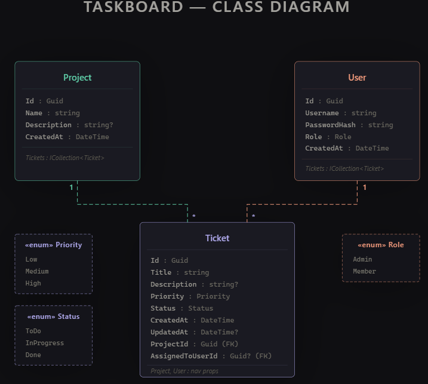

# TaskBoard

A Clean Architecture ASP.NET Core Web API for managing projects and tickets on a task board. Demonstrates CQRS with MediatR, the Repository Pattern with Entity Framework Core, JWT authentication, and role-based access control.

## Tech Stack

- **.NET 10** / ASP.NET Core Web API
- **Entity Framework Core 10** with SQL Server
- **MediatR** for CQRS (Commands and Queries)
- **AutoMapper** for entity ↔ DTO mapping
- **FluentValidation** with a MediatR `ValidationBehavior` pipeline
- **JWT Bearer** authentication (`System.IdentityModel.Tokens.Jwt`)
- **BCrypt.Net-Next** for password hashing
- **Scalar** (OpenAPI) for API documentation
- Postman collection included under `docs/`

## Architecture

The solution is split into four projects following Clean Architecture. Dependencies point inward — `Domain` has no dependencies, and `API` depends on everything else only through `Infrastructure`.

```
TaskBoard.API            -> Controllers, middleware, OpenAPI/Scalar, DI composition root
TaskBoard.Application    -> Commands, Queries, Handlers, DTOs, Validators, IRepository
TaskBoard.Domain         -> Entities (Project, Ticket, User) and enums
TaskBoard.Infrastructure -> AppDbContext, EF Core migrations, Repository<T>, JWT auth setup
```

### Project Structure

```
TaskBoard/
├── docs/
│   └── TaskBoard.postman_collection.json
├── src/
│   ├── TaskBoard.API/
│   │   ├── Configurations/SecuritySchemeTransformer.cs
│   │   ├── Controllers/
│   │   │   ├── AuthController.cs
│   │   │   ├── ProjectsController.cs
│   │   │   └── TicketsController.cs
│   │   ├── Middleware/ExceptionHandlingMiddleware.cs
│   │   ├── Program.cs
│   │   └── appsettings.json
│   ├── TaskBoard.Application/
│   │   ├── Behaviors/ValidationBehavior.cs
│   │   ├── Commands/
│   │   │   ├── Auth/        (Register, Login)
│   │   │   ├── Projects/    (CreateProject)
│   │   │   └── Tickets/     (Create, Update, Delete)
│   │   ├── Queries/
│   │   │   ├── Projects/    (GetAllProjects)
│   │   │   └── Tickets/     (GetAllTickets, GetTicketById)
│   │   ├── DTOs/
│   │   ├── Interfaces/IRepository.cs
│   │   ├── Mappings/        (AutoMapper profiles)
│   │   └── DependencyInjection.cs
│   ├── TaskBoard.Domain/
│   │   ├── Enums/           (Priority, Role, Status)
│   │   └── Models/          (Project, Ticket, User)
│   └── TaskBoard.Infrastructure/
│       ├── Database/AppDbContext.cs
│       ├── Migrations/
│       ├── Repositories/Repository.cs
│       └── DependencyInjection.cs
└── TaskBoard.slnx
```

## Domain Model

- **Project** — `Id`, `Name`, `Description`, `CreatedAt`, `Tickets`
- **Ticket** — `Id`, `Title`, `Description`, `Priority`, `Status`, `CreatedAt`, `UpdatedAt`, `ProjectId`, `AssignedToUserId`
- **User** — `Id`, `UserName`, `PasswordHash`, `Role`, `CreatedAt`, `Tickets`

Relationships:
- `Project` 1 — N `Ticket`
- `User` 1 — N `Ticket`

### Class Diagram


## Implementation Highlights

- **CQRS + MediatR** — every controller action dispatches a Command or Query through `IMediator`. Write and read paths are separated under `Application/Commands` and `Application/Queries`.
- **Repository Pattern** — generic `IRepository<T>` defined in `Application/Interfaces`, implemented in `Infrastructure/Repositories/Repository.cs` against EF Core.
- **AutoMapper** — entities never leak out of the API; handlers map to `ProjectDto` / `TicketDto` before returning.
- **Pipeline Behavior** — `ValidationBehavior<TRequest, TResponse>` runs all registered FluentValidation validators before a handler executes. Failures throw `ValidationException`, which is translated to a 400 by `ExceptionHandlingMiddleware`.
- **JWT Authentication** — `POST /api/auth/login` returns a signed JWT with `NameIdentifier`, `Name`, and `Role` claims. Protected endpoints use `[Authorize]`.
- **RBAC** — two roles, `Admin` and `Member`. Admin-only endpoints use `[Authorize(Roles = "Admin")]`.
- **Exception Handling Middleware** — centralized mapping of `ValidationException` → 400, `KeyNotFoundException` → 404, `UnauthorizedAccessException` → 401, otherwise 500.

## Prerequisites

- .NET 10 SDK
- SQL Server (LocalDB or SQL Server Express)
- `dotnet-ef` tool (`dotnet tool install --global dotnet-ef`)

## Setup

### 1. Clone

```bash
git clone <repo-url>
cd TaskBoard
```

### 2. Configure the JWT signing key (user secrets)

The JWT signing key is intentionally kept out of source control. Set it via user secrets before running the API:

```bash
cd src/TaskBoard.API
dotnet user-secrets set "Jwt:Key" "your-long-random-secret-at-least-32-chars"
```

`Jwt:Issuer` and `Jwt:Audience` are already set in `appsettings.Development.json`.

### 3. Configure the connection string

The default connection string in `appsettings.Development.json` targets `localhost\SQLEXPRESS` with Windows authentication and database `TaskBoardDB`. Edit it if your SQL Server instance is different.

### 4. Apply database migrations

From the repository root:

```bash
dotnet ef database update --project src/TaskBoard.Infrastructure --startup-project src/TaskBoard.API
```

### 5. Run the API

```bash
dotnet run --project src/TaskBoard.API
```

Scalar API reference is then available at `/scalar/v1` in development.

## API Endpoints

| Method | Route                   | Auth              | Description                   |
|--------|-------------------------|-------------------|-------------------------------|
| POST   | `/api/auth/register`    | Public            | Register a new user (Member)  |
| POST   | `/api/auth/login`       | Public            | Log in and receive a JWT      |
| POST   | `/api/projects`         | `Admin`           | Create a project              |
| GET    | `/api/projects`         | Authenticated     | List all projects             |
| POST   | `/api/tickets`          | Authenticated     | Create a ticket               |
| GET    | `/api/tickets`          | Authenticated     | List all tickets              |
| GET    | `/api/tickets/{id}`     | Authenticated     | Get a ticket by id            |
| PUT    | `/api/tickets/{id}`     | Authenticated     | Update a ticket               |
| DELETE | `/api/tickets/{id}`     | `Admin`           | Delete a ticket               |

Send the JWT as `Authorization: Bearer <token>` on protected endpoints.

### Roles

New users register as `Member` by default. To promote a user to `Admin`, update the `Role` column directly in the database (value `0` = `Admin`, `1` = `Member`).

## Documentation

- **Scalar** — interactive API reference at `/scalar/v1` when running in development.
- **OpenAPI** — machine-readable spec at `/openapi/v1.json`.
- **Postman** — collection at `docs/TaskBoard.postman_collection.json`, importable into Postman.

## Git Workflow

- `main` is protected — no direct pushes, all changes land via Pull Request.
- Each feature is developed on its own branch (`feature/<name>`) and merged into `main` through a PR.
- Commit history on `main` reflects one feature per merge commit.
